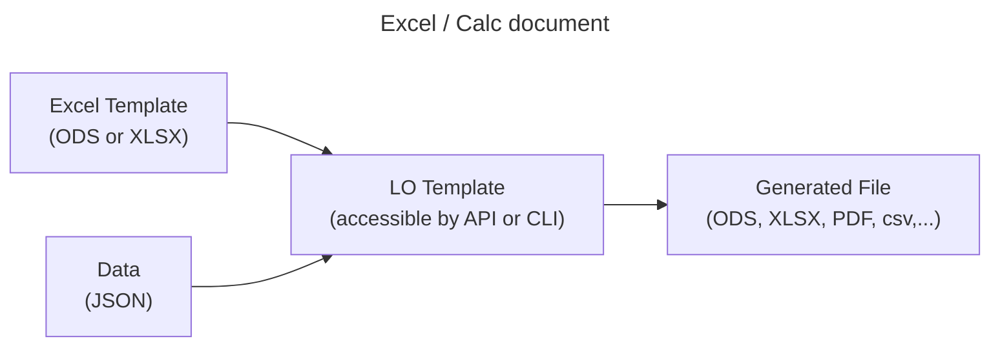
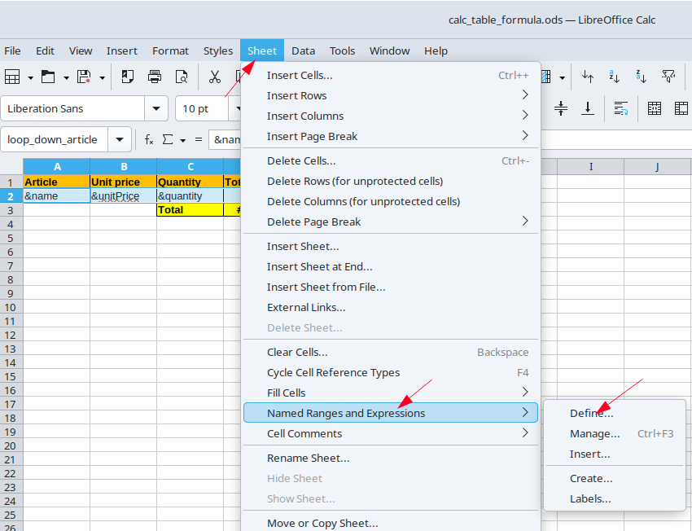
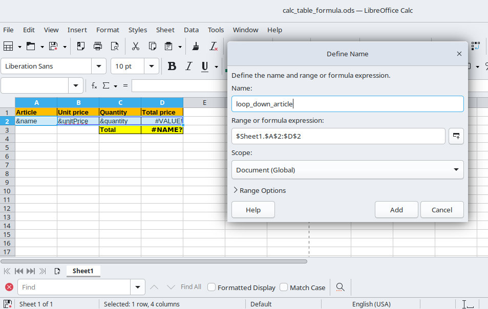
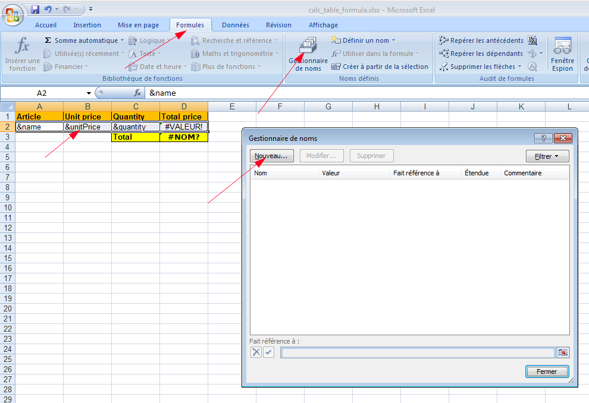
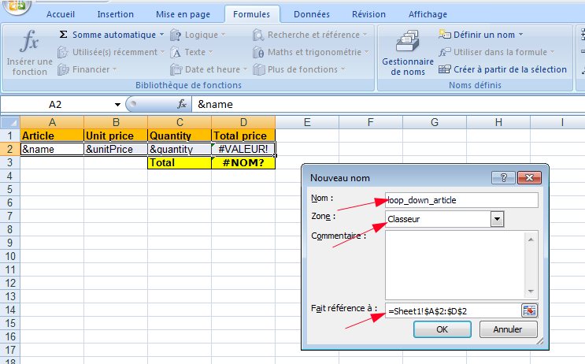

LOTemplate (for Libre Office Template)
======================================

**Warning** : This readme is for the version 2.x of LoTemplate. There are breaking changes between versions 1.x and 2.x. See [UPGRADE.md](UPGRADE.md) documentation. You can also see the [CHANGELOG.md](CHANGELOG.md) for the versions.


[](https://github.com/Probesys/lotemplate/actions/workflows/unittest.yml)

<a name="principles"></a>Principles
----------

LOTemplate is document generator used to create documents programatically (ODT, DOCX,ODS, XLSX, PDF) from an office template and a json file.




What makes this tool different from others are the following features :

* The templates are in office format (ods,odt, docx, xlsx, ... ) format
* Word Template can have complex structures (variables, loop, conditions, counters, html,...) 
* The tool can scan the template to extract the variables sheet
* The tool can be called by an API, a CLI or a python module.
* The tool uses a real LibreOffice headless to fill the templates. Then the output formats are all the LibreOffice supported formats (docx, xlsx, pdf, odt, ods, text, rtf, html, ...)

The tool is written in Python and use a real LibreOffice headless to fill the templates.

Table of content
----------------

* [Principles](#installation)
* [Quick Start](#quick_start)
* [API and CLI Usage](#api-and-cli-usage)
* [DOCX and ODT Template syntax and examples](#docx-and-odt-template-syntax)
* [XLSX and ODS Template syntax and examples](#xlsx-and-ods-template-syntax)
* [Supported formats](#supported-formats)
* [Doc for developpers of lotemplate](#doc-for-devs)
* [Unsolvable problems](#unsolvable-problems)
* [Installation without Docker](#installation_without_docker)
* [External documentations](#external-documentations)


<a name="quick_start"></a>Quick start
-----------

### Run the project with docker compose

Use the docker-compose.yml at the root of the project. Configure the .env file

run the service

```shell
docker-compose up -d
```

### Use the API

```bash
# creation of a directory
curl -X PUT -H 'secretkey: lopassword' -H 'directory: test_dir1' http://localhost:8000/
# {"directory":"test_dir1","message":"Successfully created"}
```

Let's imagine we have an file basic_test.odt (created by libreoffice) like this :

```
Test document

let’s see if the tag $my_tag is replaced and this $other_tag is detected.
[if $my_tag == foo]My tag is foo[endif]
[if $my_tag != foo]My tag is not foo[endif]
```

Upload this file to lotemplate

```bash
# upload a template
curl -X PUT -H 'secretkey: lopassword' -F file=@/tmp/basic_test.odt http://localhost:8000/test_dir1
# {"file":"basic_test.odt","message":"Successfully uploaded","variables":{"my_tag":{"type":"text","value":""},"other_tag":{"type":"text","value":""}}}

# generate a file titi.odt from a template and a json content
curl -X POST \
    -H 'secretkey: lopassword' \
    -H 'Content-Type: application/json' \
    -d '{"name":"my_file.odt","variables":{"my_tag":{"type":"text","value":"foo"},"other_tag":{"type":"text","value":"bar"}}}' \
    --output titi.odt http://localhost:8000/test_dir1/basic_test.odt 
```

After the operation, you get the file titi.odt with this content :

```
Test document

let’s see if the tag foo is replaced and this bar is detected.

My tag is foo

```


<a name="api-and-cli-usage"></a>API and CLI Usage
-------------------------------------

### With the API

#### Examples of curl requests

```bash
# creation of a directory
curl -X PUT -H 'secretkey: my_secret_key' -H 'directory: test_dir1' http://lotemplate:8000/
# {"directory":"test_dir1","message":"Successfully created"}
curl -X PUT -H 'secretkey: my_secret_key' -H 'directory: test_dir2' http://lotemplate:8000/
# {"directory":"test_dir2","message":"Successfully created"}

# look at the created directories
curl -X GET -H 'secretkey: my_secret_key' http://lotemplate:8000/
# ["test_dir2","test_dir1"]

# delete a directory (and it's content
curl -X DELETE -H 'secretkey: my_secret_key' http://lotemplate:8000/test_dir2
# {"directory":"test_dir2","message":"The directory and all his content has been deleted"}

# look at the directories
curl -X GET -H 'secretkey: my_secret_key' http://lotemplate:8000/
# ["test_dir1"]
```

Let's imagine we have an odt file (created by libreoffice) like this :

```
Test document

let’s see if the tag $my_tag is replaced and this $other_tag is detected.
```

Upload this file to lotemplate

```bash
# upload a template
curl -X PUT -H 'secretkey: my_secret_key' -F file=@/tmp/basic_test.odt http://lotemplate:8000/test_dir1
{"file":"basic_test.odt","message":"Successfully uploaded","variables":{"my_tag":{"type":"text","value":""},"other_tag":{"type":"text","value":""}}}

# analyse an existing file and get variables
curl -X GET -H 'secretkey: my_secret_key'  http://lotemplate:8000/test_dir1/basic_test.odt
# {"file":"basic_test.odt","message":"Successfully scanned","variables":{"my_tag":{"type":"text","value":""},"other_tag":{"type":"text","value":""}}}

# generate a file titi.odt from a template and a json content
 curl -X POST -H 'secretkey: my_secret_key' -H 'Content-Type: application/json' -d '{"name":"my_file.odt","variables":{"my_tag":{"type":"text","value":"foo"},"other_tag":{"type":"text","value":"bar"}}}' --output titi.odt http://lotemplate:8000/test_dir1/basic_test.odt 
```

After the operation, you get the file titi.odt with this content :

```
Test document

let’s see if the tag foo is replaced and this bar is detected.
```

#### API reference

Then use the following routes :

*all routes take a secret key in the header, key `secretkey`, that correspond to the secret key configured in the 
[.env](.env) file. If no secret key is configured, the secret key isn't required at request.*

- `/`
  - `PUT` : take a directory name in the headers, key 'directory'. Creates a directory with the specified name
  - `GET` : returns the list of existing directories

- `/<directory>` : directory correspond to an existing directory
  - `GET` : returns a list of existing templates within the directory, with their scanned variables
  - `PUT` : take a file in the body, key 'file'. Uploads the given file in the directory, and returns the saved file 
    name and its scanned variables
  - `DELETE` : deletes the specified directory, and all its contents
  - `PATCH` : take a name in the headers, key 'name'. Rename the directory with the specified name.

- `/<directory>/<file>` : directory correspond to an existing directory, and file to an existing file within the 
  directory
  - `GET` : returns the file and the scanned variables of the file
  - `DELETE` : deletes the specified file
  - `PATCH` : take a file in the body, key 'file'. replace the existing file with the given file. 
    returns the file and the scanned variables of the file
  - `POST` : take a json in the raw body.
    fills the template with the values given in the json. returns the filled document(s).
- `/<directory>/<file>/download` : directory correspond to an existing directory, and file to an existing file within 
  the directory
  - `GET` : returns the original template file, as it was sent

you may wish to deploy the API on your server. 
[Here's how to do it](https://flask.palletsprojects.com/en/2.0.x/deploying/) - 
*but don't forget that you should have soffice installed on the server*

You can also change the flask options - like port and ip - in the [.flaskenv](.flaskenv) file.
If you're deploying the app with Docker, port and ip are editable in the [Dockerfile](Dockerfile).
You can also specify the host and port used to run and connect to soffice as command line arguments,
or in a config file (`config.yml`/`config.ini`/`config` or specified via --config).


### Execute and use the CLI

Run the script with the following arguments :
```
usage: lotemplate_cli.py [-h] [--json_file JSON_FILE [JSON_FILE ...]]
                         [--json JSON [JSON ...]] [--output OUTPUT]
                         [--config CONFIG] [--host HOST] [--port PORT]
                         [--scan] [--force_replacement] template_file

positional arguments:
  template_file         Template file to scan or fill

optional arguments:
  -h, --help            show this help message and exit
  --json_file JSON_FILE , -jf JSON_FILE
                        Json files that must fill the template, if any
  --json JSON , -j JSON 
                        Json strings that must fill the template, if any
  --output OUTPUT, -o OUTPUT
                        Names of the filled files, if the template should
                        be filled. supported formats: pdf, html, docx, png, odt
  --config CONFIG, -c CONFIG
                        Configuration file path
  --host HOST           Host address to use for the libreoffice connection
  --port PORT           Port to use for the libreoffice connexion
  --scan, -s            Specify if the program should just scan the template
  --cpu                 Specify the number of libreoffice to start, default 0 is
                        the number of CPU and return the information, or fill it.
  --force_replacement, -f
                        Specify if the program should ignore the scan's result
```

Args that start with '--' (e.g. --json) can also be set in a config file
(`config.yml`/`config.ini`/`config` or specified via --config). Config file syntax allows: key=value,
flag=true, stuff=[a,b,c] (for details, [see syntax](https://pypi.org/project/ConfigArgParse/)).
If an arg is specified in more than one place, then commandline values
override config file values which override defaults.

All the specified files can be local or network-based.

Get a file to fill with the `--scan` argument, and fill the fields you want. Add elements to the list
of an array to dynamically add rows. Then pass the file, and the completed json file(s) (using `--json_file`)
to fill it.


<a name="docx-and-odt-template-syntax"></a>DOCX and ODT Template syntax and examples
----------------------------------------------------------

### text variables

Put `$variable` in the document is enough to add the variable 'variable'.

A variable name is only composed by chars, letters or underscores.

You can also use "function variables". It is exactly the same as simple variables
but with a syntax that allows you a more flexible variable name :

examples :

```
# simple variable
$my_var
$MyVar99_2020

# basic function variable
$my_var(firstName)
$my_var(address.city)

# you have to escape parenthesis inside the parameter in the
# variable name with a backslash
$my_var(firstName\(robert\))
```

Then in the json, function variable are working exactly like simple variables.

```json
{
  "my_var": {
    "type": "text",
    "value": "my value"
  },
  "MyVar99_2020": {
    "type": "text",
    "value": "my value"
  },
  "my_var(firstName)": {
    "type": "text",
    "value": "my value"
  },
  "my_var(address.city)": {
    "type": "text",
    "value": "my value"
  },
  "my_var(firstName\\(robert\\))": {
    "type": "text",
    "value": "my value"
  }
}
```

### html variables

Html variables are exactly like text variables, but the html is interpreted when
the variable is replaced in the document.

To declare a variable as an html variable, we only have to change the type in the json and send "html" instead of "text".

```json
{
  "my_var": {
    "type": "html",
    "value": "my value with <strong>html formatting</strong>"
  }
}
```

Limitation : Html is not interpreted into "shape content". For example for a text associated to a rectangle inserted into the document.

### image variables

Add any image in the document, and put in the title of the alt text of the image (If your are using MsOffice you can use the Description field)
(properties) '$' followed by the desired name ('$image' for example to add the image 'image')

### dynamic arrays

You can add an unknown number of rows to the array but only on the last line.
Add the dynamic variables in the last row of the table, exactly like text variables, but with a '&' instead of a the '$'

### if statement

You can use if statement in order to display or to hide a part of your document.

There is many operators : 

* `==` : test if the var is equal to the value (case-insensitive)
* `!=` : test if the var is not equal to the value (case-insensitive)
* `===` : test if the var is equal to the value (case-sensitive)
* `!==` : test if the var is not equal to the value (case-sensitive)
* `IS_EMPTY` : check if the var is empty (empty means empty or only spaces, tabs or newlines)
* `IS_NOT_EMPTY` : check if the var is not empty (empty means empty or only spaces, tabs or newlines)
* `CONTAINS` : check if the var contains the value (case-insensitive)
* `NOT_CONTAINS` : check if the var does not contain the value (case-insensitive)

```
[if $my_var == my_value]
$my_var equals my_value (case insensitive)
[endif]

[if $my_var === my_value]
$my_var equals my_value (case sensitive)
[endif]

[if $my_var != my_value]
$my_var does not equals my_value (case insensitive)
[endif]

[if $my_var !== my_value]
$my_var does not equals my_value (case sensitive)
[endif]

[if $my_var CONTAINS y_VAl]
This part will be displayed if $my_var contains y_VAl (case insensitive)
[endif]

[if $my_var NOT_CONTAINS dlfksqjqm]
This part will be displayed if $my_var does not contain dlfksqjqm
[endif]

[if $my_var IS_EMPTY]
This part will be displayed if my_var is empty (empty means empty or only spaces, tabs or newlines)
[endif]

[if $my_var IS_NOT_EMPTY]
This part will be displayed if my_var is empty (empty means empty or only spaces, tabs or newlines)
[endif]
```

You can put an if statement inside another if statement

```
[if $foo == my_value]
[if $bar == my_value2]
here you have your document
[endif]
[if $bar == my_value3]
here you have your document
[endif]
[endif]
```

### for statement

You can use for statement in order to display a part of your
document multiple times.

WARNING : the for system loses the formating of the template. If you want a
specific formating, you have to put it in an HTML statement.

You have to send an array in the json file with a dict inside the array

```json
{
  "tutu": {
    "type": "array",
    "value": [
      {
        "firstName": "perso 1",
        "lastName": "string 1",
        "address": {
          "street1": "8 rue de la paix",
          "street2": "",
          "zip": "75008",
          "city": "Paris",
          "state": "Ile de France"
        }
      },
      {
        "firstName": "perso 2",
        "lastName": "lastname with < and >",
        "address": {
          "street1": "12 avenue Jean Jaurès",
          "street2": "",
          "zip": "38000",
          "city": "Grenoble",
          "state": "Isère"
        }
      }
    ]
  }
}
```

Then in your template file you can use the for like this :

```
Tests of for statements

[for $tutu]
Associate number [forindex]
first name : [foritem firstName] 
last name escaped by default [foritem lastName]
last name escaped html [foritem lastName escape_html]
last name not escaped [foritem lastName raw]
Address : 
[foritem address.street1]
[foritem address.zip] [foritem address.city]
[endfor]
```

* `[forindex]` : this is a counter beginning at 0 indicating the iteration count.
* `[foritem firstName]` : variable firstName of the current iteration.
* `[foritem lastName escape_html]` : variable lastName of the current iteration escaped by html.
* `[foritem lastName raw]` : variable lastName of the current iteration not escaped.
* `[foritem address.street1]` : variable address.street1 of the current iteration when you have a hierarchy

Note : you can use if inside for statements

Here we display only the people living in Grenoble
```
[for $tutu]
[if [foritem address.city] == Grenoble]
first name : [foritem firstName] 
last name : [foritem lastName]
Address : 
[foritem address.street1]
[foritem address.zip] [foritem address.city]
[endif]
[endfor]
```

Here we display only the first element of the array
```
[for $tutu]
[if [forindex] == 0]
first name : [foritem firstName] 
last name : [foritem lastName]
[endif]
[endfor]
```

Note : If you are using `[forindex]` inside a variable name, the variable
is excluded from the parsing of the template. It allows you to create a
dynamic variable name inside a for loop. Ex : `$my_var(people.[forindex].name)` is
excluded from the variable parsing.

### html statement

You can use html statement in order to display a part of your document with a specific formating.

Here is some examples that ca be use inside an odt template

```
[html]
<table>
<tr>
  <td>First Name</td>
  <td>Last Name</td>
</tr>
<tr>
  <td>First Name</td>
  <td>Last Name</td>
</tr>
</table>
[endhtml]
```

Then all the html content is interpreted and pasted as html. It is then rendered
as a formated text (a table in this example) inside the document.

You can also display a variable that contains an html content inside an html statement

```
[html]
$my_html_variable
[endhtml]
```

with the associated json :

```json
{
  "tutu": {
    "type": "text",
    "value": "my <strong>html formated</strong> content"
  }
}
```

As the for statement removes formatting, you can use the html statement combined with the
for statement to display a table with a specific formating.

Let's see an example with the following json :

```json
{
  "tutu": {
    "type": "array",
    "value": [
      {
        "firstName": "perso 1",
        "lastName": "string 1",
        "address": {
          "street1": "8 rue de la paix",
          "street2": "",
          "zip": "75008",
          "city": "Paris",
          "state": "Ile de France"
        }
      },
      {
        "firstName": "perso 2",
        "lastName": "lastname with < and >",
        "address": {
          "street1": "12 avenue Jean Jaurès",
          "street2": "",
          "zip": "38000",
          "city": "Grenoble",
          "state": "Isère"
        }
      }
    ]
  }
}
```

and the odt template :

```
[html]
<table>
<tr>
  <td>First Name</td>
  <td>Last Name</td>
</tr>
[for $tutu]
<tr>
  <td>[foritem firstName escape_html]</td>
  <td>[foritem lastName escape_html]</td>
</tr>
[endfor]
</table>
[endhtml]
```

### counter statement

You can use counter statement in order to display values that will be incremented step by step in your document. It
can be used for example to have a heading automatic numbering.

**WARNING** : generally you don't have to use this counter feature. You can use the automatic numbering of Word or Libre Office

#### basic usage of counter

In your odt, you can use :

```
chapter [counter chapter] : introduction

chapter [counter chapter] : context

[counter paragraph] : geopolitical context

[counter paragraph] : geographical context

[counter paragraph] : economical context

chapter [counter chapter] : analysis
[counter.reset paragraph]
[counter paragraph] : geopolitical analysis

[counter paragraph] : geographical analysis

[counter paragraph] : economical analysis
```

It will be transformed in : 

```
chapter 1 : introduction

chapter 2 : context

1 : geopolitical context

2 : geographical context

3 : economical context

chapter 3 : analysis

1 : geopolitical analysis

2 : geographical analysis

3 : economical analysis
```

The possible syntaxe are :

* `[counter counter_name]` : increment the counter "counter_name" and display it
* `[counter counter_name hidden]` : increment the counter "counter_name" without displaying it
* `[counter.reset counter_name]` : reset the counter "counter_name" to 0
* `[counter.last counter_name]` : display the last value of the counter "counter_name" without incrementing it
* `[counter.format counter_name format_name]` : change the format of the counter
    * `[counter.format counter_name number]` : the counter is displayed as a number (default)
    * `[counter.format counter_name letter_lowercase]` : the counter is displayed as a letter (a, b, c, ...)
    * `[counter.format counter_name letter_uppercase]` : the counter is displayed as a letter (A, B, C, ...)


#### You can display hierarchical counters by just using `counter.last`:

```
chapter [counter chapter] : introduction

chapter [counter chapter] : context

[counter.last chapter].[counter paragraph] : geopolitical context

[counter.last chapter].[counter paragraph] : geographical context

[counter.last chapter].[counter paragraph] : economical context

chapter [counter chapter] : analysis
[counter.reset paragraph]
[counter.last chapter].[counter paragraph] : geopolitical analysis

[counter.last chapter].[counter paragraph] : geographical analysis

[counter.last chapter].[counter paragraph] : economical analysis
```

The result will be

```
chapter 1 : introduction

chapter 2 : context

2.1 : geopolitical context

2.2 : geographical context

2.3 : economical context

chapter 3 : analysis

3.1 : geopolitical analysis

3.2 : geographical analysis

3.3 : economical analysis
```

#### count the number of elements of a list

```
[counter.reset iterator]

[for $solutions]

Title : [foritem title]

Content : [foritem paragraph]

[counter iterator hidden]
[endfor]

we displayed [counter.last iterator] solutions
```


<a name="xlsx-and-ods-template-syntax"></a>XLSX and ODS Template syntax and examples
----------------------------------------------------------

The idea is to generate a real CALC / Excel file from a template, with potentially several sheets, variables to replace, dynamic tables, operations, etc.

The replacements are done in all the sheets of the document.

### Simple variables replacements

If you have a excel template like this :

<table>
<tr>
  <td>Name</td>
  <td>$myname</td>
</tr>
<tr>
  <td>Hours</td>
  <td>$myhours</td>
</tr>
<tr>
  <td>days</td>
  <td>=B2/7 (displays "#VALUE!")</td>
</tr>
</table>


And a json file like this :

```json
{
  "name": "simple_vars_result.xlsx",
  "variables": {
    "myhours": {
      "type": "text",
      "value": "12"
    },
    "myname": {
      "type": "text",
      "value": "Gérard"
    }
  }
}
```

You obtain a excel like this

<table>
<tr>
  <td>Name</td>
  <td>Gérard</td>
</tr>
<tr>
  <td>Hours</td>
  <td>12</td>
</tr>
<tr>
  <td>days</td>
  <td>=B2/7 (displays "1.71428571428571")</td>
</tr>
</table>

You can format the cells, add formulas, etc. Everything is kept in the final document.

### Dynamic tables

#### Example with a document LibreOffice Calc as a template

Dynamic tables are a bit more tricky. We are using "Named ranges".

Lets say you have a calc (.ods) document like this :

<table>
<tr>
  <td>Article</td>
  <td>Unit price</td>
  <td>Quantity</td>
  <td>Total</td>
</tr>
<tr>
  <td>&name</td>
  <td>&unitPrice</td>
  <td>&quantity</td>
  <td>=B2*C2</td>
</tr>
<tr>
  <td></td>
  <td></td>
  <td>Total Price</td>
  <td>=SUM(INDEX(loop_down_article, ,4))</td>
</tr>
</table>

Note 1 : the `&` is used to indicate that the cell content is a array.
Note 2 : the SUM is strange : it is related to a "name range"

In order to explain to lotemplate that you want to duplicate the line 2 to the bottom, you have to create a named range that is named "loop_down_article". For that :
- select the cells that you want to be duplicated (A2 to D2 in this example)
- go to Sheet -> Named ranges and expressions -> Define
- give a name to the range (loop_down_article in this example)





Note : in the name of the range, "loop_down_" says that we want to insert the lines to the bottom. There is only two possibilities : "loop_down_" and "loop_right_". Le last part (article in the example) is only here to give a unique name to the range.

Now that we have a named range, we can use it to calculate the total price of the lines. The formula `=SUM(INDEX(loop_down_article, ,4))` will sum all the values of the 4th column of the named range "loop_down_article".

Then you can use the following json file :

```json
{
  "name": "calc_table_formula.html",
  "variables": {
    "loop_down_article": {
      "type": "object",
      "value": {
        "name": {
          "type": "table",
          "value": [
            "appel",
            "banana",
            "melon",
            "lemon"
          ]
        },
        "unitPrice": {
          "type": "table",
          "value": [
            "1",
            "1.5",
            "3.2",
            "0.8"
          ]
        },
        "quantity": {
          "type": "table",
          "value": [
            "4",
            "6",
            "2",
            "1"
          ]
        }
      }
    }
  }
}
```

The result of the generation will be :

<table>
<tr>
  <td>Article</td>
  <td>Unit price</td>
  <td>Quantity</td>
  <td>Total</td>
</tr>
<tr>
  <td>apple</td>
  <td>1</td>
  <td>4</td>
  <td>=B2*C2 (display 4)</td>
</tr>
<tr>
  <td>banana</td>
  <td>1.5</td>
  <td>6</td>
  <td>=B2*C2 (display 9)</td>
</tr>
<tr>
  <td>melon</td>
  <td>3.2</td>
  <td>2</td>
  <td>=B2*C2 (display 6.4)</td>
</tr>
<tr>
  <td>lemon</td>
  <td>0.8</td>
  <td>1</td>
  <td>=B2*C2 (display 0.8)</td>
</tr>
<tr>
  <td></td>
  <td></td>
  <td>Total Price</td>
  <td>=SUM(INDEX(loop_down_article, ,4)) (display 20.2)</td>
</tr>
</table>

#### Example with a document Excel as a template

The principle is exactly the same as for LibreOffice Calc exept for the creation of the named range.





(sorry, my excel is in french...)

<a name="supported-formats"></a>Supported formats
-------------------------------------------------

### Import
| Format                  | ODT, OTT |ODS, ODST |XLSX, XLS | HTML | DOC, DOCX | RTF | TXT | OTHER |
|-------------------------|----------|----------|----------|------|-----------|-----|-----|-------|
| text variables support  | ✅        | ✅        | ✅        | ✅    | ✅         | ✅   | ✅   | ❌     |
| dynamic tables support  | ✅        | ✅       | ✅       | ✅    | ✅         | ✅   | ❌   | ❌     |
| image variables support | ✅        | ❌        | ❌        | ✅    | ✅         | ❌   | ❌   | ❌     |

### Export
For Writer
odt, pdf, html, docx.
For Calc
ods, xls, xlsx, html, csv

Other formats can be easily added by adding the format information in the dictionary `formats` of the respective classes
Format information can be found on the 
[unoconv repo](https://github.com/unoconv/unoconv/blob/94161ec11ef583418a829fca188c3a878567ed84/unoconv#L391).

<a name="doc-for-devs"></a>Doc for developpers of lotemplate
-----------------------------------------------------------

### Run the tests

You need to have docker and docker-compose installed and then run

```bash
make tests
```

### Installation with Docker for dev when your uid is not 1000

for this we use fixuid (https://github.com/boxboat/fixuid)

you have to define two env variable MY_UID and MY_GID with your uid and gid
copy docker-compose.override.yml.example to docker-compose.override.yml

```shell
export MY_UID=$(id -u)
export MY_GID=$(id -g)
cp docker-compose.override.yml.example docker-compose.override.yml
docker-compose up
```


<a name="installation_without_docker"></a>Installation without Docker
---------------------------------------

### Requirements

For Docker use of the API, you can skip this step.

- LibreOffice (the console-line version will be enough)
- python3.8 or higher
- python3-uno
- some python packages specified in [requirement.txt](requirements.txt) that you can install with
  `pip install -r requirements.txt`. `Flask` and `Werkzeug` are optional, as they are used only for the API.

```bash
# on debian bookworm, you can use these commands
apt update
apt -y -t install bash python3 python3-uno python3-pip libreoffice-nogui
pip install -r requirements.txt
```

### Run the API

Run the following command on your server :

```shell
python3 -m flask run
```

or simply

```shell
flask run
```

or, for Docker deployment:

```shell
docker-compose up
```


<a name="external-documentations"></a>External documentations
---------------------------------------------------------


For Pyuno

-  [LibreOffice SDK API Reference](https://api.libreoffice.org/docs/idl/ref/index.html)
- [LibreOffice 24.2 API Documentation](https://api.libreoffice.org/) 

- [Libreoffice Development Wiki](https://wiki.documentfoundation.org/Development)
- [JODConverter wiki for list formats compatibles with LibreOffice](https://github.com/sbraconnier/jodconverter/wiki/Getting-Started)
- [The unoconv source code, written in python with PyUNO](https://github.com/unoconv/unoconv/blob/master/unoconv)
- [Unoconv source code for list formats - and properties - compatible with LibreOffice for export](https://github.com/unoconv/unoconv/blob/94161ec11ef583418a829fca188c3a878567ed84/unoconv#L391)


